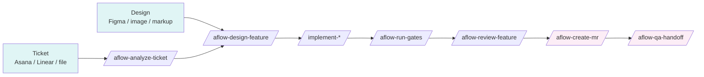
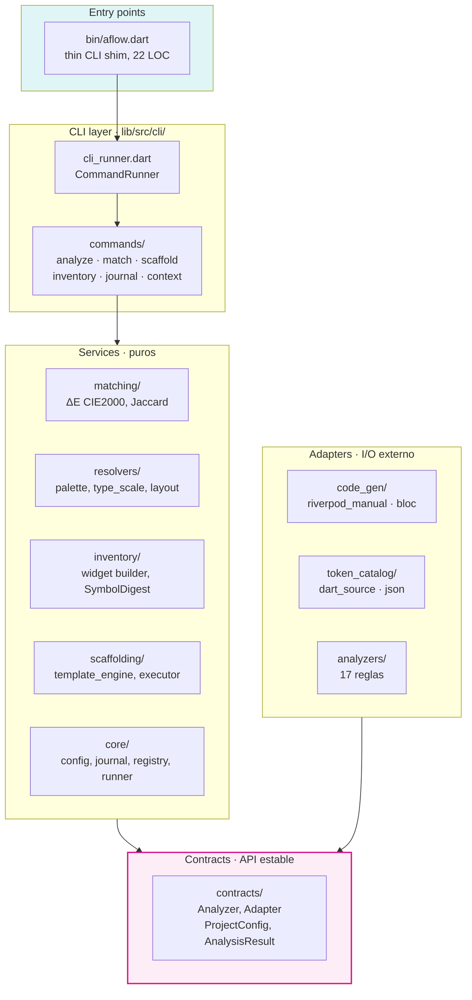
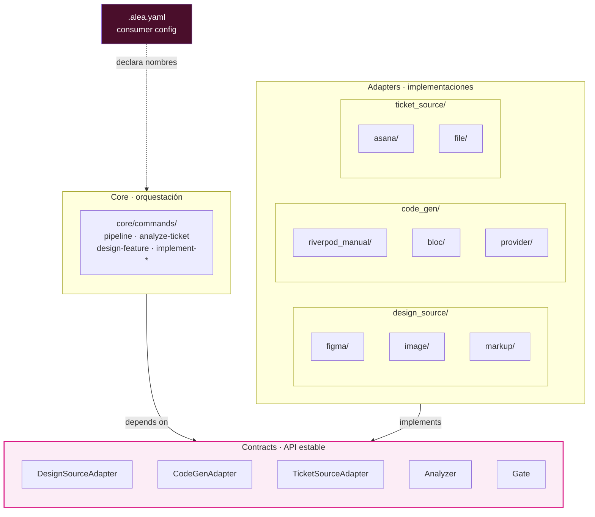
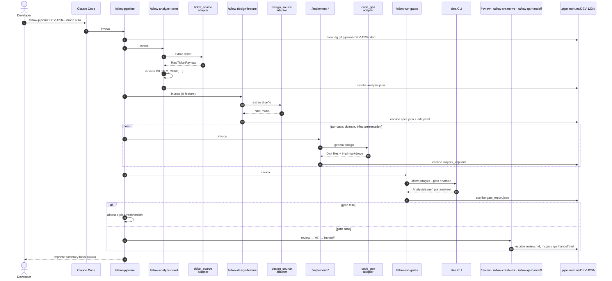
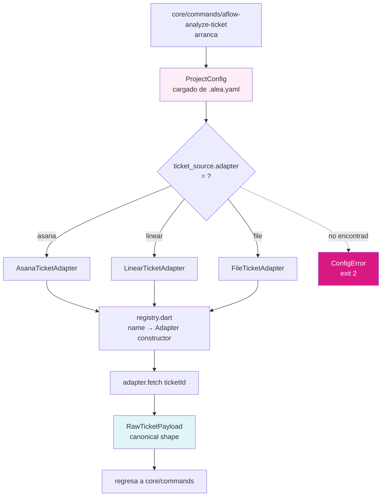
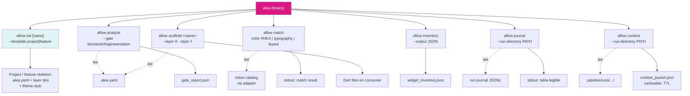
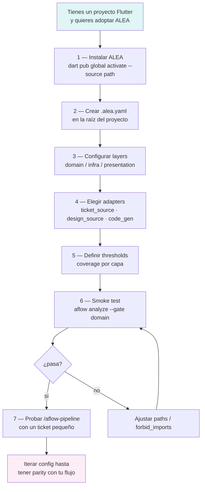
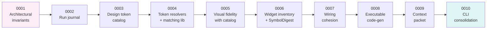

# ALEA — Walkthrough visual

> Compañero visual de la documentación existente. **No duplica prosa**: cada sección apunta al archivo canónico y añade el diagrama o tabla que ese archivo no tiene.

---

## 0. Cómo usar este documento

Lee los diagramas de este archivo **mientras** lees los docs de prosa que se referencian. Cada diagrama está pensado para responder una pregunta concreta:

| Pregunta | Sección | Doc complementario |
|---|---|---|
| ¿Qué es ALEA y qué problema resuelve? | [§1](#1-contexto-de-1-minuto) | [../README.md](../README.md) |
| ¿Cómo está organizado el código? | [§2](#2-mapa-del-paquete) | [../README.md#project-layout](../README.md) |
| ¿Cuál es la arquitectura? | [§3](#3-arquitectura-ports--adapters) | [../ARCHITECTURE.md](../ARCHITECTURE.md) |
| ¿Cómo fluye una corrida de ticket → MR? | [§4](#4-secuencia-de-una-corrida-completa) | [../core/commands/aflow-pipeline.md](../core/commands/aflow-pipeline.md) |
| ¿Cómo se elige un adapter en runtime? | [§5](#5-selección-de-adapters-en-runtime) | [../ARCHITECTURE.md#patterns](../ARCHITECTURE.md) |
| ¿Qué artefactos produce cada comando? | [§6](#6-flujo-de-artefactos) | [../ARCHITECTURE.md#module-responsibilities](../ARCHITECTURE.md) |
| ¿Qué hace cada subcomando del CLI? | [§7](#7-mapa-del-cli) | [../README.md#3--run-a-subcommand](../README.md) |
| ¿Cómo adopto ALEA en un proyecto? | [§8](#8-onboarding-de-un-consumer) | [CONSUMER_INTEGRATION.md](CONSUMER_INTEGRATION.md) |
| ¿Por qué se tomó cada decisión clave? | [§9](#9-decisiones-clave-adrs) | [adr/](adr/) |

---

## 1. Contexto de 1 minuto

ALEA es un **paquete Dart distribuible** que orquesta el flujo **ticket → merge request** para cualquier proyecto Flutter consumidor. Todo lo específico del proyecto vive en un único archivo `.alea.yaml` en la raíz del consumer; todo lo reutilizable vive en este paquete.

Cada caja en la fila central es un **slash command** documentado en [../core/commands/](../core/commands/). La línea recta no es opcional: cada comando lee artefactos JSON/YAML escritos por el comando anterior, persistidos en `.pipeline/runs/<ticket_id>/` dentro del working tree del consumer.

**Comienza por:** [../README.md](../README.md) (10 minutos de lectura — explica qué es, status v0.1.0, quickstart).

---

## 2. Mapa del paquete

**Invariantes duros** (enforced en CI por `PackageBoundaryAnalyzer` — ver [adr/0001-architectural-invariants.md](adr/0001-architectural-invariants.md)):

- `contracts/` es puro — solo `dart:core`, `dart:async`, `dart:convert`, `package:meta`.
- `matching/` es puro — sin I/O, sin analyzer, sin path.
- `analyzers/` NO importa `adapters/`.
- `core/` NO importa `adapters/` — selección por nombre vía `ProjectConfig` en runtime.
- `resolvers/`, `inventory/`, `scaffolding/` NO importan `adapters/`.

**Comienza por:** [../README.md#project-layout](../README.md) para el árbol de directorios anotado.

---

## 3. Arquitectura: Ports & Adapters

ALEA aplica tres patrones que convergen en la misma idea:

- **Ports and Adapters** (Cockburn) — el core conoce los puertos (interfaces), nunca los adapters.
- **Anti-Corruption Layer** (Evans) — cada adapter traduce el vocabulario externo a una forma canónica.
- **Gateway** (Fowler) — cada adapter es el único punto de acceso a un sistema externo.

**La regla que une los tres patrones:**

> Para cada familia de dependencia externa existe **exactamente UNA forma canónica** que fluye al core. Ningún campo, enum value o nombre adapter-específico aparece en la forma canónica.

| Familia | Forma canónica | Definida en |
|---|---|---|
| Ticket sources | `RawTicketPayload` | [../adapters/ticket_source/README.md](../adapters/ticket_source/README.md) |
| Design sources | `NDS` (Normalized Design Spec) | [../contracts/schemas/nds.schema.yaml](../contracts/schemas/nds.schema.yaml) |
| Code-gen targets | `CodeGenResult` | [../contracts/code_gen_adapter.dart](../contracts/code_gen_adapter.dart) |

**Comienza por:** [../ARCHITECTURE.md](../ARCHITECTURE.md) (la tabla "Principles applied" es oro — 11 principios SOLID/DDD aplicados con ejemplo concreto en ALEA).

---

## 4. Secuencia de una corrida completa

Una invocación de `/aflow-pipeline DEV-1234` ejecuta esto (modo `auto` — sin paradas humanas):

**Notas importantes:**

- `/aflow-pipeline` es **reanudable**: si se interrumpe, vuelve a correrla y detecta qué artefacto existe último para continuar desde ahí. NUNCA borres artefactos a mano. Usa `--reset` para empezar de cero (crea nuevo tag).
- **Modos** (`pipeline.default_mode` en `.alea.yaml`):
  - `guided` — para en cada gate para aprobación humana.
  - `semi` — solo para en Gate 0 (spec) y Gate Final (review).
  - `auto` — solo para en falla de validator.
- **Cost tracking** — cada fase añade a `metrics.json::estimated_cost_usd`. Si rebasa `cost_warn_usd` avisa; si rebasa `cost_hard_stop_usd` aborta.
- **Circuit breaker design-source** — si un adapter acumula hallucinations sobre cierto umbral, `pipeline-feedback` lo deshabilita en `.pipeline/config.json` automáticamente.

**Comienza por:** [../core/commands/aflow-pipeline.md](../core/commands/aflow-pipeline.md) (es el corazón del flujo; léelo entero antes de ejecutar manualmente cualquier fase).

---

## 5. Selección de adapters en runtime

¿Cómo es que `core/` "no conoce" qué adapter usar pero termina llamando al correcto?

**El truco:** `core/` solo conoce **el nombre del adapter como string**. El registry mapea ese string a un constructor. El adapter implementa la interfaz declarada en `contracts/`. Una vez devuelve `RawTicketPayload`, el resto del core no sabe (ni le importa) de qué sistema vino el dato.

Esta es la única manera en que se cumple **OCP**: agregar Jira = crear `adapters/ticket_source/jira/` + registrar nombre. Cero modificaciones a `core/` o `contracts/`.

**Comienza por:** [../lib/src/core/registry.dart](../lib/src/core/registry.dart) y [../lib/src/contracts/](../lib/src/contracts/) (las interfaces son cortas — léelas todas).

---

## 6. Flujo de artefactos

```mermaid
graph LR
    yaml[.alea.yaml]
    ticket[ticket source<br/>Asana / file / ...]
    design[design source<br/>Figma / image / ...]

    yaml --> AT[/aflow-analyze-ticket/]
    ticket --> AT
    AT --> analysisJson[analysis.json]

    analysisJson --> DF[/aflow-design-feature/]
    design --> DF
    DF --> specJson[spec.json]
    DF --> ndsYaml[nds.yaml]

    specJson --> ImpD[/aflow-implement-domain/]
    ImpD --> domainImpl[domain_impl.md<br/>+ Dart files]

    specJson --> ImpI[/aflow-implement-infrastructure/]
    ndsYaml --> ImpI
    ImpI --> infraImpl[infrastructure_impl.md<br/>+ Dart files]

    specJson --> ImpP[/aflow-implement-presentation/]
    ndsYaml --> ImpP
    ImpP --> presImpl[presentation_impl.md<br/>+ Dart files]

    domainImpl --> RG[/aflow-run-gates/]
    infraImpl --> RG
    presImpl --> RG
    yaml --> RG
    RG --> gateReport[gate_report.json]

    gateReport --> RV[/aflow-review-feature/]
    specJson --> RV
    RV --> reviewMd[review.md]

    reviewMd --> CMR[/aflow-create-mr/]
    CMR --> mrJson[mr.json]

    mrJson --> QH[/aflow-qa-handoff/]
    QH --> qaMd[qa_handoff.md]

    classDef artifact fill:#E0F5F5,stroke:#4A0E2B
    classDef external fill:#FCEDF6,stroke:#DA1884
    class analysisJson,specJson,ndsYaml,domainImpl,infraImpl,presImpl,gateReport,reviewMd,mrJson,qaMd artifact
    class yaml,ticket,design external
```

Cada comando es una **función pura desde el punto de vista de artefactos**: lee N archivos, escribe M archivos, persiste todo en `.pipeline/runs/<ticket_id>/`.

**Reglas:**

1. **Nunca renombres un artefacto.** El nombre del archivo es contrato — `/aflow-pipeline`'s resume detecta avance por presencia de archivos con nombres específicos.
2. **Cada comando imprime un summary block delimitado por `═══`** — es la forma estandarizada de comunicar al usuario qué se escribió.
3. **Los schemas** que validan estos artefactos viven en [../contracts/schemas/](../contracts/schemas/).

**Comienza por:** [../ARCHITECTURE.md#module-responsibilities](../ARCHITECTURE.md) (tabla con Reads/Writes/Knows-about por módulo).

---

## 7. Mapa del CLI

El CLI Dart (compilable a binario nativo de ~10MB) expone 14 subcomandos. La capa de orquestación (slash commands) los invoca; tú también puedes hacerlo directo en CI o en exploración manual.

| Subcomando | Para qué sirve | Exit codes |
|---|---|---|
| `init` | Bootstrap de skeleton ALEA — template `project` (Flutter app post-`flutter create`) o `feature` (Dart package en monorepo). Idempotente; respeta `--force` y `--dry-run`. Ver [ADR-0011](adr/0011-monorepo-and-bootstrap-strategy.md). | `0` aplicado · `64` invalid name |
| `analyze` | Corre todos los analyzers de un gate específico contra archivos cambiados (o todo el árbol) | `0` pass · `1` blocker/critical · `2` config error |
| `match` | Resuelve un valor (color hex, font size, spacing) contra el token catalog del consumer | `0` match exacto · `1` near-miss · `2` no encontrado |
| `scaffold` | Crea archivos boilerplate de un feature en una capa (idempotente, con rollback) | `0` aplicado · `1` conflict (necesita `--force`) |
| `inventory` | Escanea widgets del consumer y emite JSON con conteo, props, ubicación | `0` siempre (a menos que I/O falle) |
| `journal` | Lee el JSONL de eventos de una corrida y lo imprime legible | `0` siempre |
| `context` | Construye un "context packet" cacheable (con TTL y hash) para alimentar al siguiente LLM call | `0` packet generado · `1` falta input |

**Comienza por:** [../bin/aflow.dart](../bin/aflow.dart) (22 LOC, es el shim) → [../lib/src/cli/cli_runner.dart](../lib/src/cli/cli_runner.dart) → cada `commands/*_command.dart` por separado.

---

## 8. Onboarding de un consumer

**Toda la guía detallada paso-a-paso está en [CONSUMER_INTEGRATION.md](CONSUMER_INTEGRATION.md) (614 líneas).** Léela completa antes de añadir tu primer `.alea.yaml`.

---

## 9. Decisiones clave (ADRs)

Los ADRs son cortos (~3KB cada uno) y explican el "por qué" de cada decisión arquitectónica. Léelos en orden — están numerados por la secuencia en que se tomaron durante el rediseño.

| # | ADR | Por qué importa |
|---|---|---|
| 0001 | [Architectural invariants](adr/0001-architectural-invariants.md) | Define las 5 reglas duras de imports que `PackageBoundaryAnalyzer` enforcea en CI. Es la base. |
| 0002 | [Run journal](adr/0002-run-journal.md) | Formato JSONL con redaction de PII para observabilidad. Necesario antes de cualquier costing o circuit-breaker. |
| 0003 | [Design token catalog](adr/0003-design-token-catalog.md) | Cómo se extraen tokens del consumer (adapter `dart_source` o `json`). Habilita matching. |
| 0004 | [Token resolvers + matching](adr/0004-token-resolvers-and-matching-library.md) | Biblioteca **pura** de matching (ΔE CIE2000, Jaccard). El cerebro del visual fidelity. |
| 0005 | [Visual fidelity with catalog](adr/0005-visual-fidelity-with-catalog.md) | Cómo el analyzer usa el catalog para detectar `color_not_in_catalog`, etc. |
| 0006 | [Widget inventory + SymbolDigest](adr/0006-widget-inventory-and-symbol-digest.md) | Reducción de tokens ≥70% para LLM context. Habilita corridas baratas. |
| 0007 | [Wiring cohesion](adr/0007-wiring-cohesion.md) | Analyzer config-driven de registro DI/route. |
| 0008 | [Executable code-gen](adr/0008-executable-code-generation.md) | Adapters Riverpod-manual y Bloc; idempotencia + rollback. |
| 0009 | [Context packet](adr/0009-context-packet.md) | Caching con TTL + hash invalidation. |
| 0010 | [CLI consolidation](adr/0010-cli-consolidation.md) | Unificación a `alea (analyze | match | scaffold | inventory | journal | context)`. |

**Comienza por:** [adr/0001-architectural-invariants.md](adr/0001-architectural-invariants.md) — sin entender los invariantes, el resto se siente arbitrario.

---

## 10. Ruta de lectura recomendada — orden definitivo

Si tienes **1 hora**: 1 → 2 → 3 (no leas más, ejecuta el quickstart).

Si tienes **medio día**: 1–7.

Si vas a contribuir código: lee todo, incluyendo cada README por subdirectorio.

| # | Archivo | Lo que aprendes | Tiempo |
|---|---|---|---|
| 1 | [../README.md](../README.md) | Qué es ALEA, status, quickstart, layout | 10 min |
| 2 | Este archivo (§1–§7) | Vista visual + flujo de una corrida | 15 min |
| 3 | [../ARCHITECTURE.md](../ARCHITECTURE.md) | Patrones aplicados, contratos, extension points | 20 min |
| 4 | [CONSUMER_INTEGRATION.md](CONSUMER_INTEGRATION.md) | Cómo adoptar ALEA en un proyecto real | 30 min |
| 5 | [adr/0001-architectural-invariants.md](adr/0001-architectural-invariants.md) | Las reglas duras que CI enforcea | 10 min |
| 6 | [../core/commands/aflow-pipeline.md](../core/commands/aflow-pipeline.md) | El orquestador maestro | 20 min |
| 7 | [../lib/src/contracts/](../lib/src/contracts/) (todos los `.dart`) | La superficie API estable | 15 min |
| 8 | [adr/0002](adr/0002-run-journal.md) → [adr/0011](adr/0011-monorepo-and-bootstrap-strategy.md) | Las 10 decisiones siguientes en orden | 1.5 h |
| 9 | [../adapters/README.md](../adapters/README.md) + un adapter completo (ej. [../adapters/code_gen/riverpod_manual/README.md](../adapters/code_gen/riverpod_manual/README.md)) | Cómo se ve un adapter concreto | 30 min |
| 10 | [../lib/src/analyzers/](../lib/src/analyzers/) (browse) | Cómo se implementa un analyzer | 30 min |

---

## 11. Glosario rápido

| Término | Qué es |
|---|---|
| **Consumer** | Proyecto Flutter que adopta ALEA poniendo un `.alea.yaml` en su raíz. |
| **`.alea.yaml`** | Único archivo de config del consumer; declara package name, layers, adapters elegidos, thresholds, brand tokens. |
| **Adapter** | Folder bajo `adapters/<family>/<name>/` que implementa una interfaz de `contracts/` para un sistema externo concreto. |
| **NDS** | Normalized Design Spec — forma canónica que produce cualquier design-source adapter. |
| **Gate** | Validación de salida/calidad de una fase. Puede fallar la corrida. |
| **Analyzer** | Regla automatizada que escanea código fuente y emite `AnalysisIssue[]`. |
| **Slash command** | Markdown en `core/commands/` que un IDE (Claude Code, Cursor, Gemini CLI) interpreta como prompt orquestado. |
| **Run journal** | `events.jsonl` por corrida — la fuente de verdad para observabilidad y costo. |
| **Context packet** | Cacheable bundle de contexto LLM con TTL y hash de invalidación. |
| **Circuit breaker** | Mecanismo que deshabilita un adapter automáticamente si su tasa de hallucinations excede el umbral. |

---

*Última actualización: 2026-05-24. Si actualizas la arquitectura o agregas un adapter / analyzer, actualiza también el diagrama correspondiente.*
